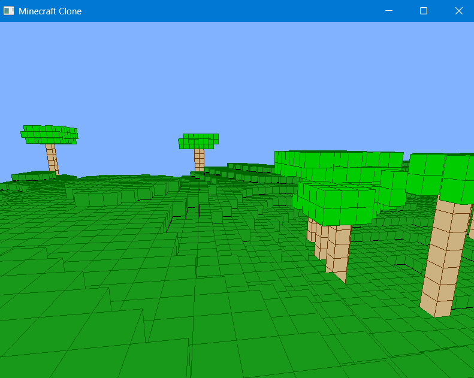
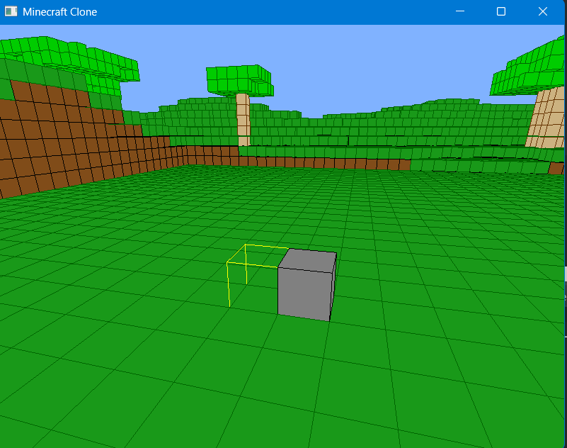

## Eseguire il server

C:\devops\MinecraftClone>java -jar target\MinecraftClone-1.0.jar server

## Eseguire il client

Esegui Main.java

## Revert GIT

git checkout -- .

## Nuovo branch

git checkout -b dev2

git push --set-upstream origin dev2

## Demo

